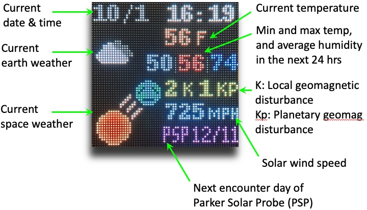
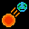
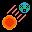
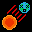

## Data, Colors and Icons Displayed on our LED Panel

Our LED panel displays earth weather information on its upper half and space weather information on its bottom half.

</a>

Our Raspberry Pi Python program gets the current date and time with Python's [datetime module](https://docs.python.org/3/library/datetime.html) and displays them at the top of the panel.

### Earth Weather Data

Our Python program downloads the current and forecast weather data from [OpenWeatherMap](https://openweathermap.org/) and displays them at the upper right portion of the panel.  

- Current temperature (Fahrenheit/Celsius)
- Maximum and minimum temperature in the next 24 hours (Fahrenheit/Celsius)
- Average humidity in the next 24 hours (%)

Also, our program downloads the [current weather condition](https://openweathermap.org/weather-conditions) from OpenWeatherMap and displays an icon for the condition at the upper left portion of the panel. It displays one of the following icons:

| Icon      | Weather |
| :----:      | :---      |
|  | clear sky|
|  | Few clouds |
|  | Scattered clouds |
|  | Broken clouds |
|  | Shower rain |
|  | Rain |
|  | Thunderstorm |
|  | Snow |
|  | Mist |

### Space Weather Data

| Icon      | Weather |
| :----:      | :---      |
|  | clear sky|
|  | Few clouds |
|  | Scattered clouds |
|  | Broken clouds |
|  | Shower rain |
|  | Rain |

space weather (geomagnetic disturbance in Kp-index). K- and Kp-index values are colored on the panel based on the NOAA scale.
