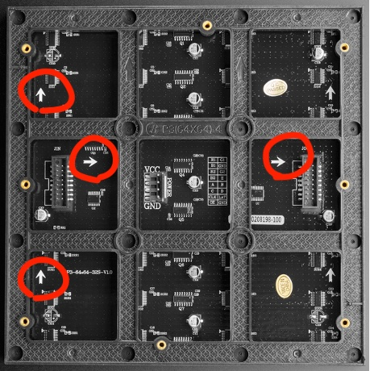
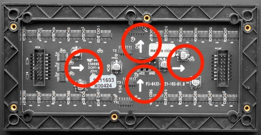
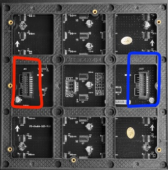
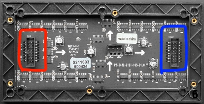
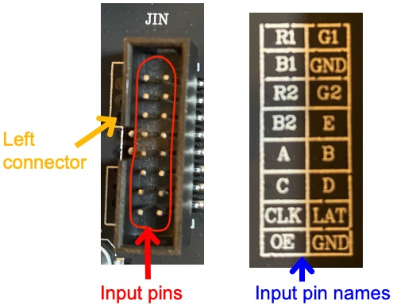
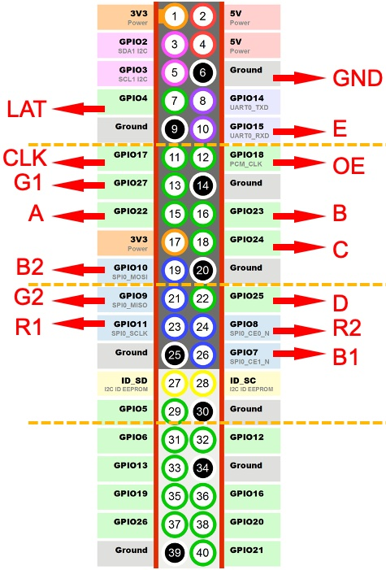
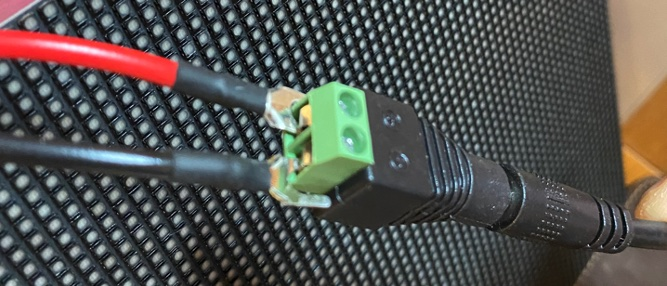

# Hardware

## Required Hardware

- Raspberry Pi (Raspi) Zero WH ([Adafruit](https://www.adafruit.com/product/3708), [Amazon](https://smile.amazon.com/Raspberry-Pi-Zero-WH-Pre-soldered/dp/B07B8MMD3V/))
  - You also need a Micro SD card ([Adafruit](https://www.adafruit.com/product/2693), [Amazon](https://www.amazon.com/gp/product/B073K14CVB/)) and a power supply cable ([Adafruit](https://www.adafruit.com/product/1995), [Amazon](https://smile.amazon.com/Raspberry-Power-Supply-Adapter-Charger/dp/B08523DFR4/)).
  - We used a case for Raspi Zero ([Adafruit](https://www.adafruit.com/product/4822), [Amazon](https://smile.amazon.com/Flirc-Raspberry-Pi-Zero-Case/dp/B08837L144)), but this is optional.
- LED matrix board
  - Either 64x64 ([Adafruit](https://www.adafruit.com/product/4732), [Amazon](https://www.amazon.com/Individual-Full-Color-Adjustable-Brightness-Displaying/dp/B0B65J1D9Q/)) or 64x32 ([Adafruit](https://www.adafruit.com/product/2279), [Amazon](https://www.amazon.com/waveshare-Full-Color-Adjustable-Brightness-Displaying/dp/B09MB426K5/)) board works. You need a 5V-10A power supply cable for a 64x64 board ([Adafruit](https://www.adafruit.com/product/658), [Amazon](https://www.amazon.com/LeTaoXing-Switching-Transformers-Interface-Replacement/dp/B08HCS1X66/)) and a 5V-4A power supply cable for a 64x32 board ([Adafruit](https://www.adafruit.com/product/1466), [Amazon](https://www.amazon.com/Facmogu-Switching-Transformer-Compatible-5-5x2-1mm/dp/B087LY41PV/)).
- Female power adapter - 2.1mm jack to screw terminal block ([Adafruit](https://www.adafruit.com/product/368), [Amazon](https://www.amazon.com/Qaoquda-Connector-Terminal-Headphone-Converter/dp/B07JMY5XXT/))
  - This adapter may be included in your LED matrix board.
- Female-female jumper wires ([Adafruit](https://www.adafruit.com/product/1949), [Amazon](https://www.amazon.com/EDGELEC-Breadboard-Optional-Assorted-Multicolored/dp/B07GD2PGY4/))
- Bluetooth speaker
  - We used [this one](https://www.amazon.com/Sony-SRS-XB13-Waterproof-Bluetooth-SRSXB13/dp/B08ZJ6DQNY/), but any Bluetooth speaker should work.

## Connect a LED matrix board to your Raspi

Make sure your Raspi is turned off. Don't connect a power cable to your LED board yet.

Flip your LED board to see its backside. See it in the following way. Pay attention to arrows.

  
  

Your LED board has 2 connectors. Each connector has 16 (2x8) pins. You will use the left one, which is shown in red in the following picture. It may be labeled like "JIN", "IN" or something similar. Ignore the connector on your right (in blue).

  
  

16 pins in the left connector are called "input pins".
Input pins have their own names.

  

Now, use the following diagram to connect input pins and GPIO pins with jumper wires.

  

Connect your power supply cable and screw terminal block. Then, connect your LED board's power cable with the screw terminal block. Connect the power cable to your LED board. 

  

Plug your power supply cable to an outlet, and turn on your Raspi.
