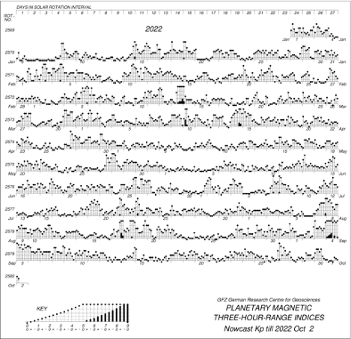

## Music of solar wind (Kp music)

Our Raspberry Pi Python program produces a piece of “music” with downloaded Kp-index values (planetary geomagnetic disturbance data) and plays it with a Bluetooth speaker. This way, LED panel viewers can listen to the "music of solar wind" (or Kp music) and feel how solar wind sings.

In Geosciences, Kp data are displayed graphically as an aid for scientists, and the graphical notation looks like a musical score. It is often called "Bartels musical diagrams," after the inventor of Kp-index, [Julius Bartels](https://en.wikipedia.org/wiki/Julius_Bartels).

This motivated us to map a sequence of Kp values to musical elements. Our current algorithm maps 28 Kp values (0, 0+, 1-, 1, 1+, 2-, ... , 9) to 28 musical notes by:  

- Mapping each Kp value to one eighth the duration of a whole note.
- Mapping Kp=0+ to the first note of a selected scale in the middle octave. Higher Kp values are mapped to remaining notes in the scale in order. Move to a higher octave if all available notes have been used in the current octave. This way, higher Kp values are mapped to higher pitch levels.
   - For example, if the C major scale is selected, Kp=0+ is mapped to the C4 note. Kp=1-, 1, 1+, 2-, 2 and 2+ are mapped to D4, E4, F4, G4, A4, and B4. Kp=3- is mapped to C5.
- Expanding the duration of the rest/note if the same Kp value repeats.
   - For example, if Kp=0 repeats twice, the two values are mapped to a quarter rest. If Kp=0 repeats 4 times, the four values are mapped to a half rest.
   - If Kp=1- repeats twice, the two values are mapped to a quarter note for D4.
- Using higher intensity if Kp >= 5.

Our algorithm can use any scale. Different scales can give different feels and vibes to the music of solar wind. For example, C major makes it sound happy, C blues scale makes it jazzy, and C minor makes it feel sad.

Our algorithm can also map each Kp value to a chord. It follows the above mapping policy and replaces each note with a triad chord whose root is the note. For example, Kp=1- is mapped to a triad of [C4,E4,G4]. Kp=1 and Kp=1+ are mapped to [D4,F4,A4] and [E4,G4,B4]. Chords can give depth to the music of solar wind.

We use 3 out of 4 properties of sound, pitch, duration and intensity, in our algorithm. We are planning to use the remaining property, timbre, to make the music of solar wind more musical. Another plan is to use the properties of music, such as rhythm, in our algorithm.
