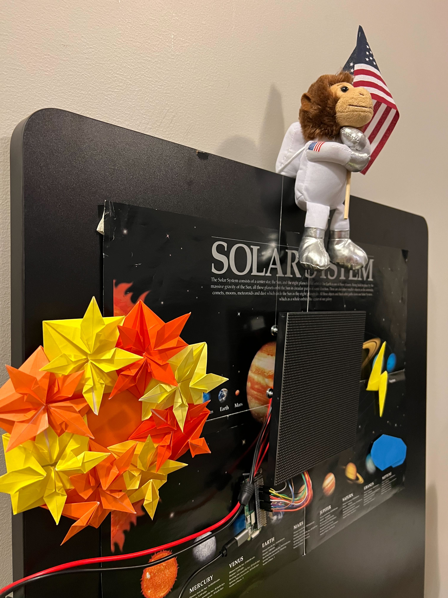
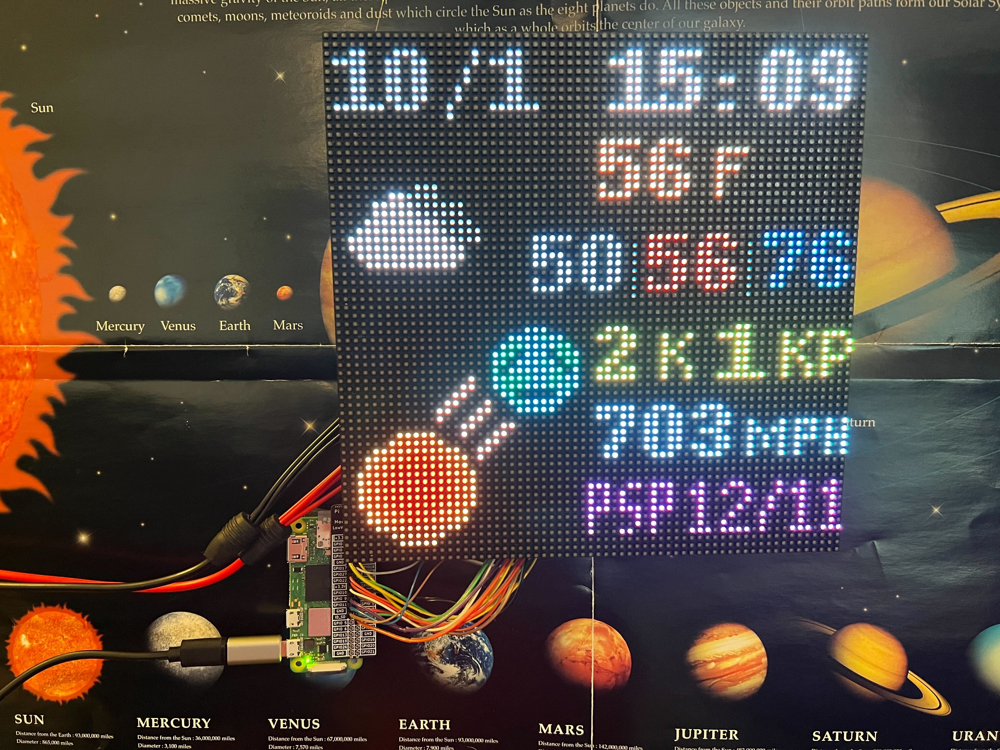
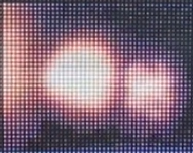
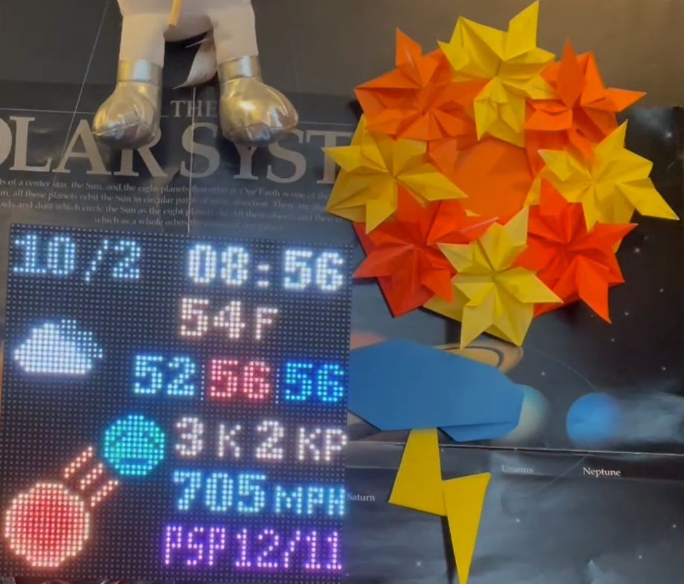
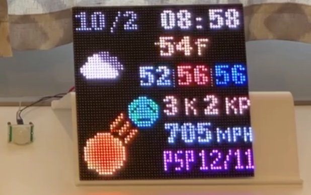
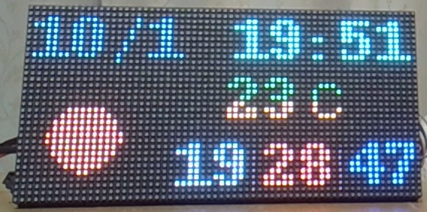
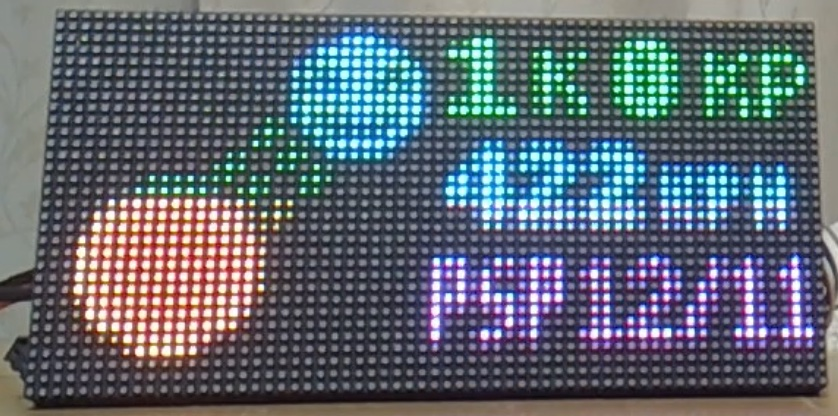
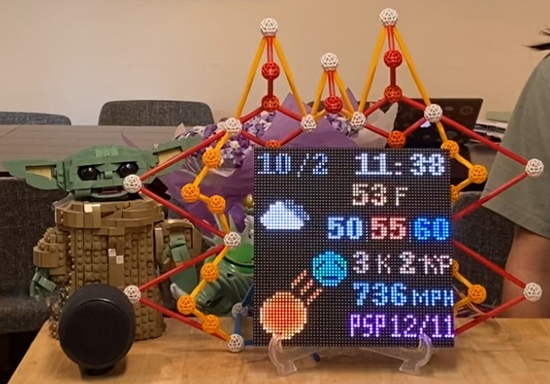
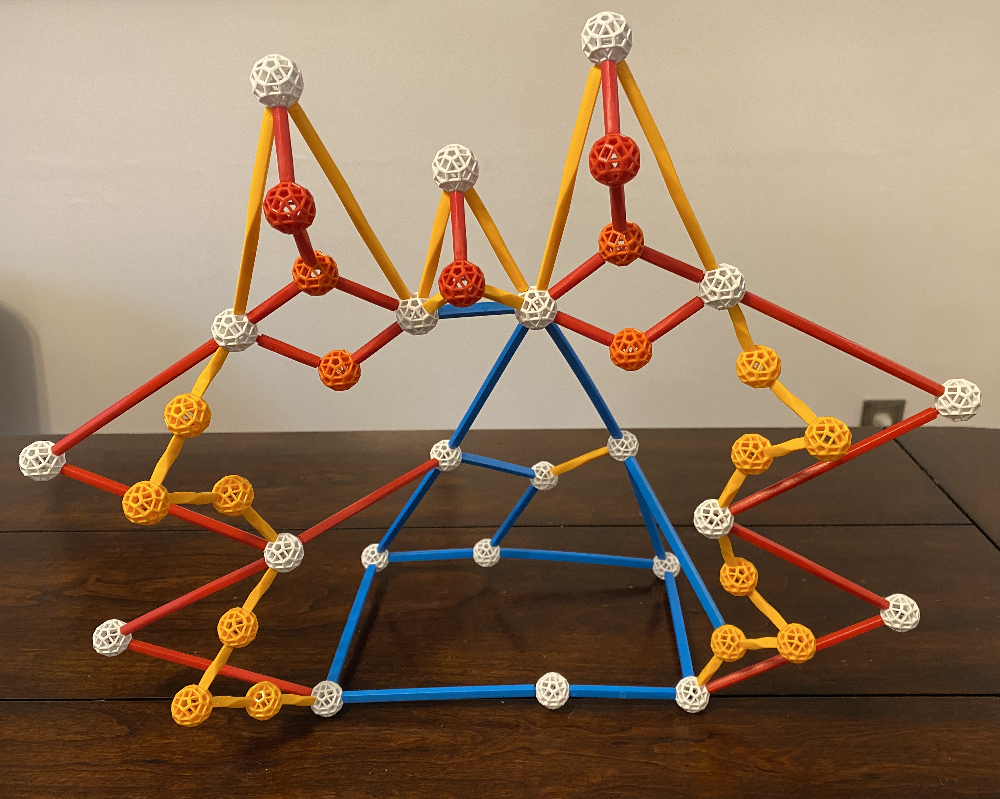
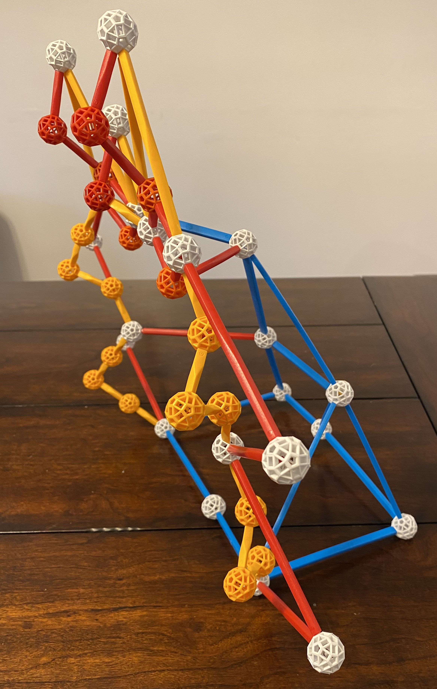

## LED Panel Prototypes

We made 5 prototypes in this project.

### Prototype 1

This prototype is wall-mounted. A 64x64 LED matrix board and Raspberry Pi are attached to a backer board.

This prototype replays GIF animation videos after showing earth and space weather information.

This prototype is decorated with origami crafts that model the Sun, clouds and lightning.

### Prototype 2

This prototype is motion-activated. Raspberry Pi is connected with a 64x64 LED matrix board and a motion sensor (Passive InfaRed sensor: PIR sensor). It turns on the board when the sensor detects nearby motion, and turns off the board if no motion is detected for a while. This way, it can better interact with panel viewers while saving power consumption.

### Prototype 3

This prototype uses a 64x32 (rectangular) LED matrix board. Our Python program can run for 64x32 boards as well as 64x64 boards. Since the 64x32 board size is too small to show both earth and space weather, it displays the two weather information in turn.

Our Python program implements imperial and metric units, and it can switch one unit system to another:

- Fahrenheit for temperature and miles per hour (MPH) for solar sind speed.
- Celsius for temperature and Kilometers per hour (KPH) for solar wind speed.

Since this prototype was built in Japan, it shows a K-index value that a Japanese geomagnetic observatory measured.

### Prototype 4

This prototype

producing the "music of solar wind"

a 64x64 LED matrix board

