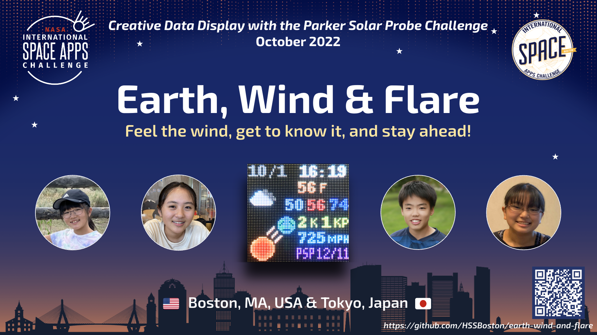

  

We are a team of 4 students who participated in the [2022 NASA Space Apps Challenge](https://2022.spaceappschallenge.org/):

- Hanna Suzuki
- Yuto Yashiro
- Kurumi Kamio
- Akari Takekawa

NASA Space Apps Challenge is an annual hackathon event (or an innovation incubation and civic engagement program) where NASA puts out about 30 challenges for participants around the world to develop innovative solutions.

We are excited and honored to be [one of 35 Global Finalists](https://2022.spaceappschallenge.org/awards/global-finalists/), which were selected from 5,327 teams worldwide (31,561 participants from 162 countries) by NASA and 10 other space agencies!

<!-- We participated in the Boston division of Space Apps and won the **1st place** there! We are excited to be be [one of global nominees](https://2022.spaceappschallenge.org/locations/boston/teams)!-->

Our team worked on the ["Creative Data Display with the Parker Solar Probe" challenge](https://2022.spaceappschallenge.org/challenges/2022-challenges/creative-data-display/) to "create an interactive tool to represent" data about the Sun, which the Parker Solar Probe and other spacecrafts have gathered, "in a new and inviting way that improves public knowledge and understanding of space weather." We built an LED panel that shows space weather (such as solar wind speed and geomagnetic disturbance) as well as earth weather with visual and acoustic effects. It is made up of a Raspberry Pi computer (credit card sized computer), 64-pixel by 64-pixel LED matrix board, motion sensor and Bluetooth speaker. Our ultimate goal is to help raise public awareness of space weather.

This web site provides hardware and software setup guide, circuit diagrams, and ready-to-run Python programs. You can immediately learn how to reproduce our LED panel. We hope you find this project interesting and useful and then learn something about space weather. You can even join us to spread the word and data about space weather with this LED panel! Let's also stay tuned to Parker Solar Probe's [next encounter to the Sun at December 11](https://sppgway.jhuapl.edu/encounters).

- [Official team web page](https://2022.spaceappschallenge.org/challenges/2022-challenges/creative-data-display/teams/earth-wind-flare/) at SpaceAppsChallenge.org
- [7-page project summary](https://docs.google.com/presentation/d/1-ZGbrkdS6af0Wx6mRLc8-YR0kJKUlLiomiPoth3ZvuA/)
    - PDF version: Demo videos do not work in this PDF version.
- [Oral presentation video](https://youtu.be/_Xmb9laCBRE) for Boston local judging
- [Oral Presentation slides](https://docs.google.com/presentation/d/17I9ZgF2RXYX0MeCR6q1414WrXGxQ1NQp2aaNcb6b71I/) at Boston local judging
    - [PDF version](./docs/boston-local-presentation.pdf): Demo videos do not work in this PDF version.
- [Data display](./display/): Data, colors and icons displayed on our LED panel
- [LED panel prototypes](./prototypes/): Pictures and videos
- [Music of solar wind (Kp music)](./kp-music/)
- [Hardware setup](./hardware/): Required hardware, LED matrix wiring, motion sensor setup and circuit diagrams
- Software code: Raspberry Pi OS setup, required software library and online service accounts, and [Python code](./code/).

### Short Project Summary

We built an Internet of Things (IoT) device that publicizes space weather and its impacts on Earth in an interactive and artistic way. Our device's key elements include (1) an LED matrix board to show space weather (such as solar wind speed and geomagnetic disturbance) as well as earth weather, (2) a variety of international data sources (such as NASA, NOAA, Kakioka magnetic observatory in Japan and German Research Centre for Geosciences) and (3) visual and acoustic effects in data display, such as producing the "music of solar wind" by mapping geomagnetic disturbance data to musical elements. Our ultimate goal is to help raise public awareness of space weather.

### Detailed Project Summary

Although space weather has significant impacts on our life, most people don’t know about it. In fact, many of our team members didn't. Most of our parents, grandparents and friends didn't either. The Sun has been more and more active these days, and geomagnetic storms will happen around 2024 or 2025, more or less. However, many are not prepared enough; some might be in panic if a storm attacks.

We are a group of 4 students who try to approach this issue by building an LED panel that shows both earth and space weather with visual and acoustic effects. It is designed to help panel viewers know and interpret space weather as they do for earth weather. It can also help them get better informed and better prepared. Ultimately, we want to help raise public awareness of space weather and its impacts on Earth.

We have diverse skills and experience: coding, Raspberry Pi hacks, music (piano and music theory) and crafting. So, we decided to use them in our project. We built an LED panel that is made up of Raspberry Pi (credit card sized computer) and a 64-pixel by 64-pixel LED matrix board. Its upper half shows earth weather, and its bottom half shows space weather. There are many LED panel products that can show earth weather on market, but we have not seen any panel that can show both earth and space weather .

We wrote Python programs for Raspberry Pi to download earth and space weather data and display that on the LED panel. Since we are an international team (three members in the Greater Boston area in MA and one in Japan), our programs use a variety of international data sources and support multiple units such as Fahrenheit, Celsius, miles and kilometers:

- Earth weather data:
  - Current temperature (F/C)
  - Maximum and minimum temperature in the next 24 hours (F/C)
  - Average humidity in the next 24 hours (%)
  - Downloaded these data from OpenWeatherMap.org
- Space weather data:
  - Geomagnetic disturbance (K-index) in the US and Japan:
    - NOAA and Kakioka Geomagnetic Observatory
  - Planetary K-index (Kp-index):
    - NOAA and German Research Center for Geosciences
  - Solar wind speed (MPH/KPH):
    - Data from NASA’s Advanced Composition Explorer (ACE) satellite
    - Downloaded this data from NOAA
  - Next encounter day (perihelion day) of Parker Solar Probe (PSP):
    - Download this data from Johns Hopkins University Applied Physics Laboratory's Web site

Our LED panel has a few visual, interactive and acoustic features to attract as many people as possible and deliver them space weather information. First, our panel can replay videos with GIF animation files. We downloaded image data of the solar K-corona that Parker Solar Probe took and configured the panel to display a few videos that are produced from those image data.

Weather icons are another visual effect that we implemented. Our panel shows different icons according to the current earth weather and space weather (geomagnetic disturbance in Kp-index). K- and Kp-index values are colored on the panel based on the NOAA scale.

Our LED panel is also motion-activated. We connected a motion sensor to Raspberry Pi so that the panel turns on when the sensor detects nearby motion and it automatically turns off when no motion is detected for a while.

For its acoustic effects, our Raspberry Pi Python program produces a piece of “music” with downloaded Kp-index values (planetary geomagnetic disturbance data) and plays it with a Bluetooth speaker. In Geosciences, Kp data are displayed graphically as an aid for scientists, and the graphical notation looks like a musical score. It is often called "Bartels musical diagrams," after the inventor of Kp-index, Julius Bartels. This motivated us to map a sequence of Kp values to musical elements, considering 3 properties of sound: pitch, duration and intensity. We also used the concepts of triads (chords), key signatures and musical scales in the mapping. LED panel viewers can listen to the "music of solar wind" and feel how solar wind sings. They can also vary it into different vibes by changing key signatures/scales.

To help raise the awareness of space weather, we plan to:

- Place our panels in schools, libraries, town halls and other places where many people are passing by.
- Ask our science teachers to cover space weather in class with our panels.
- Ask our principals about potential “geomagnetic storm days” (school closings due to geomagnetic storms) and discuss what students and teachers should expect and prepare.
- Create and publicize Space Weather Day like Earth Day in schools and towns.

Our project web site provides hardware purchase and setup guide, circuit diagrams, Raspberry Pi setup guide, installation instructions for required software tools/libraries and ready-to-run programs. Anyone interested can immediately learn how to reproduce our LED panel. We hope you find this project interesting and useful and then learn about something about space weather. You can even join us to spread the word and data about space weather with this LED panel!
